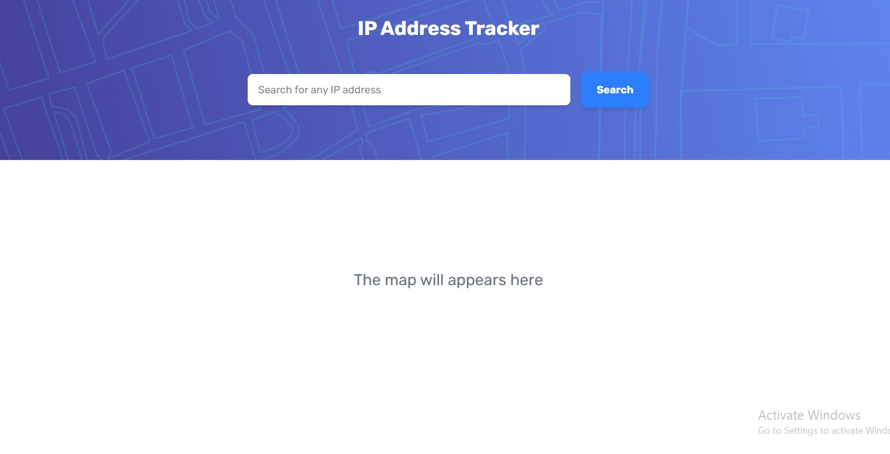

# Frontend Mentor - IP address tracker solution

This is a solution to the [IP address tracker challenge on Frontend Mentor](https://www.frontendmentor.io/challenges/ip-address-tracker-I8-0yYAH0). Frontend Mentor challenges help you improve your coding skills by building realistic projects. 

## Table of contents

- [Frontend Mentor - IP address tracker solution](#frontend-mentor---ip-address-tracker-solution)
  - [Table of contents](#table-of-contents)
    - [Screenshot](#screenshot)
    - [Built with](#built-with)
  - [Author](#author)

### Screenshot

### Built with

- Semantic HTML5 markup
- CSS custom properties
- Flexbox
- CSS Grid
- Mobile-first workflow
- [React](https://reactjs.org/) - JS library
- [Leaflet Library](https://react-leaflet.js.org)
- [IP Geolocation API by IPify](https://geo.ipify.org)

## Author

- Personal website - [Royal](https://www.your-site.com)
- Frontend Mentor - [@royal334](https://www.frontendmentor.io/profile/royal334)
- Twitter - [@SamOtuonye](https://www.twitter.com/SamOtuonye)

